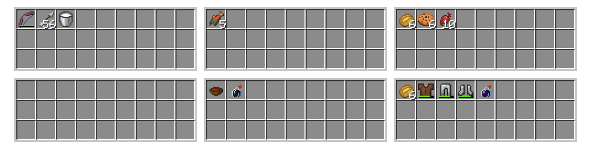
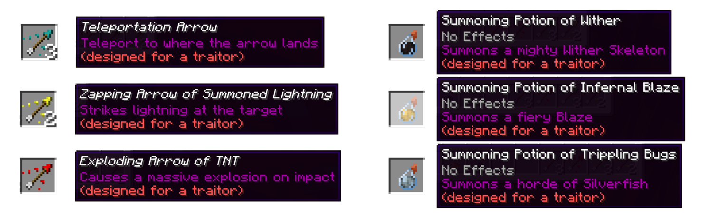

# Trouble In MC Town

This Minecraft datapack provides my own implementation of the once popular gamemode *Trouble in Terrorist Town (TTT)* which is well known from games like Garrys Mod and Counter Strike.


For getting started, you might want to [install](https://github.com/janattig/Trouble-In-MC-Town#installation) the datapack and start a round with your friends, following the [*How to play* section](#how-to-play) of the Readme.


### Installation

To install the datapack, download and copy the `TroubleInMCTown` folder into the `datapack` folder of your savegame. Then load your savegame and check if the datapack is already enabled by using the command
```mcfunction
datapack list
```
(Remember that you have to prepend a `/` when you are typing commands into the Minecraft console).

If the datapack is not yet enabled, you can manually enable it with
```mcfunction
datapack enable "file/TroubleInMCTown"
```
Once the datapack is enabled in your save, you can start a game!


### How to play

To play Trouble in MC Town, you have to check two prerequisites:
  1. gather a few friends (remember, this is a *multiplayer* gamemode)
  2. prepare an area for playing: The area in which you want to play should have some empty chests which will be filled with loot once you open them while playing. You can either prepare an area on your own or you can use my companion datapack [Procedural Dungeons](https://github.com/janattig/Procedural-Dungeons) (featured in [this](https://www.youtube.com/watch?v=Q7MZA2epbMU) video) to generate procedural levels for playing Trouble in MC Town.

Then start a round of TTT by executing the start command
```mcfunction
function trouble_in_mc_town:setup_round
```
or utilizing the [start structure](#start-structure) of this datapack which you placed in your world. Levels generated from Procedural Dungeons come with their own start structures.

Starting a round gathers all players in a 100 block radius around the function caller which are either in survival or creative mode. These participating players are then switched to adventure mode and divided into the teams **Traitor** and **Innocent**. Innocents win if they stay alive for 8 minutes (configurable) or if all Traitors are dead. Traitors win if all Innocents are dead before the 8 minutes are over.

Every player starts with random starting gear and can find more items by opening chests. In particular, Traitors can find special currency items by opening chests far away from Innocents and spend them in a so-called *Traitor Shop* which is only accessible to them. If you are killed or die during the round, you can simply respawn and will be setup as a spectator player that can observe the rest of the round (however you should avoid talking then).

Once one team has won, the round ends automatically and everyone is teleported back to where they started. If you want to prematurely end a round, you can use the command
```mcfunction
function trouble_in_mc_town:cleanup_after_round
```
which ends the current round.

So, have fun playing!


# Datapack details

In total, the datapack provides the following:
1. **Implementation of the TTT rules** - Players are divided into <span style="color:blue">**Innocent**</span> and <span style="color:blue">**Traitor**</span>. Innocents win if they stay alive for 8 minutes (configurable like many other options [here](TroubleInMCTown/data/trouble_in_mc_town/functions/installation/configure.mcfunction)) or all Traitors are dead. Traitors win if all Innocents are dead before the 8 minutes are over. Note that in contrast to the other implementations, this datapack does *not* implement the role of a *detective*.
2. [**Loot chests**](#loot-chests) - All players can find loot by opening (empty) chests around the world (best used with a pre-generated level, more coming soon). Traitors who wander around the world far away from the Innocents can find currency items which can be exchanged for extra fun Traitor-loot in the *Traitor Shop*
3. [**Special Traitor-loot**](#traitor-loot) - This loot which is exclusively available to traitors in the *Traitor Shop* contains:
    * Special Minecraft items, like Diamond armor and weapons or Enchanted Golden Apples
    * Custom Arrows with special effects, like lightning or TNT explosions. This is an adaption of Cloud Wolf's "Custom Arrows in Minecraft" Tutorial which can be found [here](https://www.youtube.com/watch?v=14mBKL53Fy0)
    * Summoning Splash Potions which summon monsters upon impact
4. [**Start structure**](#start-structure) - Pre-built structure which allows easy access to the TTT game in forms of command blocks that can be triggered by conventional buttons.


### Loot chests

During a round of TTT, players can gather more loot by opening (empty) chests around the playable area. These chests are then filled with loot according to loottables defined in the datapack. In general, the loot in these chests contains food, weapons, armor and some potions. Traitors who wander around the world far away from the Innocents can find currency items which can be exchanged for extra fun Traitor-loot in the *Traitor Shop*. [Traitor items](#traitor-loot) among others contain special items.



Normal chest loot is drawn from the loot table `trouble_in_mc_town:lootchest_main` and rare lucky loot is drawn from the loot table `trouble_in_mc_town:lootchest_lucky`.

When the round is ending, all loot chests will be purged, so no items persist beyond the scope of the round.


### Traitor loot

Traitors which open chests far away from Innocents also have a chance of finding valuable Traitor curency. These currency items can be exchanged for special items like
1. **Special Minecraft items** - Items like weapons and armor made out of diamond, with powerful enchantments, bows with OP enchantments, Enchanted Golden Apples or Invisibility potions
2. **Custom Arrows** - These arrows come with special effects unlike any ordinary Minecraft tipped arrow. The implementation of custom arrows is an adaption of Cloud Wolf's "Custom Arrows in Minecraft" Tutorial which can be found [here](https://www.youtube.com/watch?v=14mBKL53Fy0). Implemented effects range from Area Poison, over Lightning strikes and TNT to arrows which make players drop their inventory as well as teleport arrows.
3. **Summoning Splash Potions** - These potions are ordinary splash potions without effects which summon monsters upon impact.



All items which are considered special Traitor loot have the `(designed for a traitor)` tag written in their description.


### Debug mode

Since the TTT gamemode inherently is a *multiplayer* gamemode, any round consisting only of a single player will end immediately (since its team is the only reamining team, i.e. it is winning). In other words, if you want to test a map or check out how the loot works, you cannot just start a round of TTT on your own.

To do so regardless, the datapack implements a *debugging mode*. As long as this mode is active, a fictitious Innocent participates in the round so that you as the only player (and therefore Traitor) can wander around without the round ending.

To enable and disable the debugging mode, two commands are provided:
```mcfunction
function trouble_in_mc_town:debugging_on
function trouble_in_mc_town:debugging_off
```
which enable and disable the debugging mode respectively.

Note that for ending a round with debug mode active, you have to either loose, end the round manually or disable the debug mode.


### Start Structure

To provide an easier start into setting up a TTT map which utilizes the Trouble in MC Town datapack, a start structure is provided. This structure is a 5x5 platform which contains command blocks that call the respective functions to *start* and *stop* (or interrupt) rounds of TTT, as well as blocks which *enable* or *disable* the [debug mode](#debug-mode).

The start structure can be obtained with the command
```mcfunction
loot give @s loot trouble_in_mc_town:structure_ttt_start
```
which spawns a structure block with the exact reference of the structure in the player inventory. This structure block has to be placed and the structure has to be loaded.

Upon loading, the structure looks like this:

