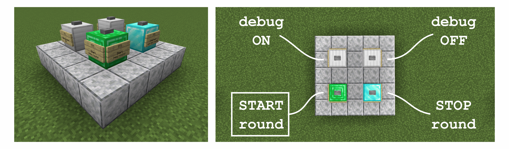

# Trouble In MC Town

This Minecraft datapack provides an adaption of the gamemode Trouble in Terrorist Town (TTT) which is well known from games like Garrys Mod and Counter Strike.


For getting started, you might want to [install](https://github.com/janattig/Trouble-In-MC-Town#installation) the datapack and start a round with your friends, following the [*How to play* section](https://github.com/janattig/Trouble-In-MC-Town#how-to-play) of the Readme.


### Datapack contents

In total, the datapack provides the following:
1. **Implementation of the TTT rules** - Players are divided into <span style="color:blue">**Innocent**</span> and <span style="color:blue">**Traitor**</span>. Innocents win if they stay alive for 8 minutes (configurable) or all Traitors are dead. Traitors win if all Innocents are dead before the 8 minutes are over. Note that in contrast to the other implementations, this datapack does *not* implement the role of a *detective*.
2. **Loot chests** - All players can find loot by opening (empty) chests around the world (best used with a pre-generated level, more coming soon). Traitors who wander around the world far away from the Innocents can find extra fun Traitor-loot
3. **Special Traitor-loot** - This loot which is exclusive to traitors contains:
    * Diamond armor and weapons
    * Enchanted Golden Apples
    * Arrows with special effects, like lightning or TNT explosions. This is an adaption of Cloud Wolf's "Custom Arrows in Minecraft" Tutorial which can be found [here](https://www.youtube.com/watch?v=14mBKL53Fy0)
    * Splash Potions which can be thrown to summon mobs
4. **Start structure** - Pre-built structure which allows easy access to the TTT game in forms of command blocks that can be triggered by conventional buttons. More information on the structure can be found in a later [section](https://github.com/janattig/Trouble-In-MC-Town#start-structure) of this Readme.


### Installation

To install the datapack, download and copy the `TroubleInMCTown` folder into the `datapack` folder of your savegame. Then load your savegame and check if the datapack is already enabled by using the command
```
/datapack list
```
if the datapack is not yet enabled, you can manually enable it with
```
/datapack enable "file/TroubleInMCTown"
```
Once the datapack is enabled in your save, you can start a game!


### How to play

... TODO ...


# More details

### Start Structure

To provide an easier start into setting up a TTT map which utilizes the Trouble in MC Town datapack, a start structure is provided. This structure is a 5x5 platform which contains command blocks that call the respective functions to *start* and *stop* (or interrupt) rounds of TTT, as well as blocks which *enable* or *disable* the debug mode in which an imaginary second player joins the game so features can be explored solo without the round ending.

The start structure can be obtained with the command
```
/loot give @s loot trouble_in_mc_town:structure_ttt_start
```
which spawns a structure block with the exact reference of the structure in the player inventory. This structure block has to be placed and the structure has to be loaded.

Upon loading, the structure looks like this:

